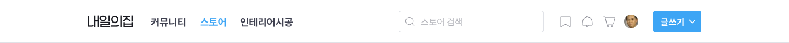

# 내일의 집

### 1. GNB

- 로그인을 하지 않은 경우


```html
<div class="button-group">
  <button
    class="gnb-icon-button is-search lg-hidden"
    type="button"
    aria-label="검색창 열기 버튼"
  >
    <i class="ic-search"></i>
  </button>
  <a
    class="gnb-icon-button is-cart"
    href="/"
    aria-label="장바구니 페이지로 이동"
  >
    <i class="ic-cart"></i>
  </a>
  <div class="gnb-auth sm-hidden">
    <a href="/">로그인</a>
    <a href="/">회원가입</a>
  </div>
</div>
```

- 로그인을 한 경우



```html
<div class="button-group">
  <button
    class="gnb-icon-button is-search lg-hidden"
    type="button"
    aria-label="검색창 열기 버튼"
  >
    <i class="ic-search"></i>
  </button>
  <a
    class="gnb-icon-button is-cart"
    href="/"
    aria-label="장바구니 페이지로 이동"
  >
    <i class="ic-cart"></i>
  </a>
  <div class="gnb-auth sm-hidden">
    <a href="/">로그인</a>
    <a href="/">회원가입</a>
  </div>
</div>
```

### 2. Sidebar

- 로그인을 하지 않은 경우

```html
<div class="sidebar-auth">
  <a href="/" class="auth-button btn-outlined btn-40">로그인</a>
  <a href="/" class="auth-button btn-primary btn-40">회원가입</a>
</div>
```

- 로그인을 한 경우

```html
<div class="sidebar-user">
  <a href="/">
    <div class="avatar-24">
      
    </div>
    <strong class="username">사달라사달라사달라사달라사달</strong>
  </a>
</div>
```
